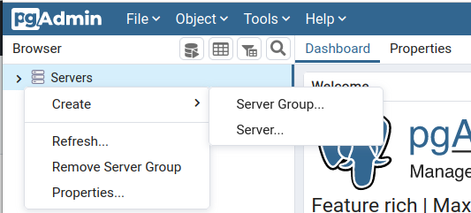
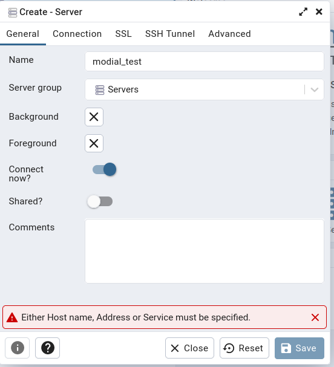
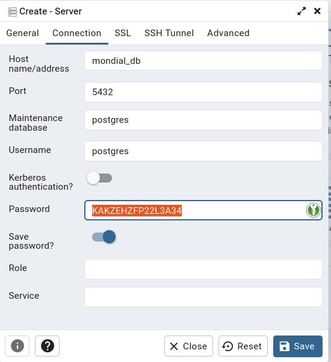

# Docker compose PGadmin example setup

## Quick steps

1. Install [Docker-Compose](https://docs.docker.com/compose/install/)
2. Install [GIT](https://git-scm.com/book/en/v2/Getting-Started-Installing-Git)
3. Open a [terminal](https://towardsdatascience.com/a-quick-guide-to-using-command-line-terminal-96815b97b955) 
4. Checkout this repository via `git clone https://github.com/ag-gipp/docker-pgadmin.git`
5. Start the containers via `docker-compose up -d`
6. Navigate to your [local pg-amdin web ui](http://localhost:5050)
7. Log in with the credentials from the [docker-compose file](https://github.com/ag-gipp/docker-pgadmin/blob/58f23d6fbebdf9c1f3ea3d4e9953d87c4a9c9627/docker-compose.yml#L17-L19)
```dockerfile
      PGADMIN_DEFAULT_EMAIL: admin@admin.com
      #Change this password
      PGADMIN_DEFAULT_PASSWORD: MFSYTZVH9HPHL92A
```
8. Connect to the database
   1. Click `Servers->Create->Server...` 
   2. In the `General` tab specify the name  
   3. In the `Connection` tab specify the credentials 
   use the password from [docker-compose file](https://github.com/ag-gipp/docker-pgadmin/blob/58f23d6fbebdf9c1f3ea3d4e9953d87c4a9c9627/docker-compose.yml#L17-L19)
```dockerfile
      #Change this password
      POSTGRES_PASSWORD: KAKZEHZFP22L3A34
```

## Simple SQL statements
<details>
<summary>Please find some sample statements below</summary>

```SQL
CREATE TABLE professor (ID Integer, 
    FirstName VARCHAR(50),
    LastName VARCHAR(50),
    Office VARCHAR(50),
    PRIMARY KEY (ID));

CREATE TABLE student (ID Integer, 
    FirstName VARCHAR(50),
    LastName VARCHAR(50),
    PRIMARY KEY (ID));

CREATE TABLE lecture (ID Integer, 
    Title VARCHAR(50),
    Credits Integer,
    Room VARCHAR(50),
    PRIMARY KEY (ID));

CREATE TABLE attends (Student Integer, 
    Lecture Integer,
    FOREIGN KEY (Student) REFERENCES student(ID),
    FOREIGN KEY (Lecture) REFERENCES lecture(ID),
    PRIMARY KEY (Student, Lecture));

CREATE TABLE teaches (Professor Integer, 
    Lecture Integer,
    FOREIGN KEY (Professor) REFERENCES professor(ID),
    FOREIGN KEY (Lecture) REFERENCES lecture(ID),
    PRIMARY KEY (Professor, Lecture));

INSERT INTO professor (ID, FirstName, LastName, Office) 
VALUES (1, 'Julia', 'Maier', 'G12.42');

INSERT INTO lecture (ID, Title, Credits, Room) 
VALUES (1, 'Datenbanken', 6, 'HS10');

INSERT INTO student (ID, FirstName, LastName) 
VALUES (1, 'Max', 'Mustermann');

INSERT INTO teaches (Professor, Lecture) 
VALUES (1, 1);

INSERT INTO attends (Student, Lecture) 
VALUES (1, 1);

-- Contraint Violation (Default NO ACTION)

DELETE FROM lecture WHERE ID = 1;

DELETE FROM professor WHERE ID = 1;

DELETE FROM student WHERE ID = 1;

-- No Contraint Violation (Default NO ACTION)

DELETE FROM attends WHERE Student = 1;
DELETE FROM student WHERE ID = 1;

-- Change attends table to CASCADE (CAREFUL!)

ALTER TABLE attends DROP CONSTRAINT attends_student_fkey;

ALTER TABLE attends ADD CONSTRAINT attends_student_fkey 
FOREIGN KEY (Student) REFERENCES student(ID) 
ON DELETE CASCADE ON UPDATE CASCADE;

-- Update/DELETE (CASCADE)

UPDATE student SET ID=2 WHERE FirstName = 'Max' and LastName='Mustermann';

DELETE FROM student WHERE ID = 2;
```
</details>
